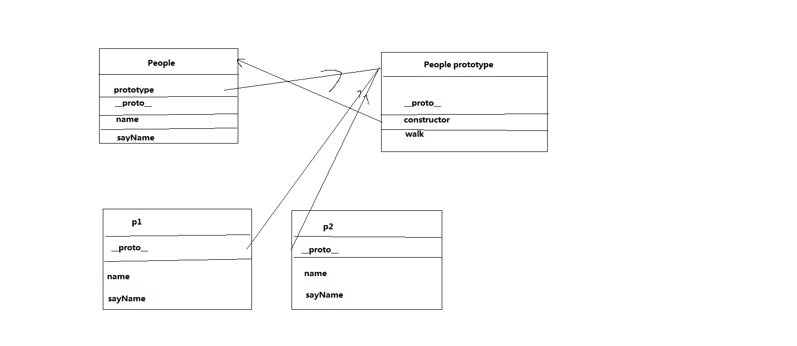

# 1. OOP 指什么？有哪些特性
object oriented programming,面向对象编程

特性：封装(把客观事物封装成抽象的类)，继承(使用现有类的所有功能，无需重新编写)，多态(覆盖，重载)
# 2.  如何通过构造函数的方式创建一个拥有属性和方法的对象? 
使用new操作符调用构造函数会经历4个步骤：

1. 创建一个新的对象;
2. 将构造函数的作用域赋给新对象;
3. 执行构造函数中的代码;
4. 返回新对象.

```
//类
function People(name){
  this.name = name;
  
  this.printName = function(){
    console.log(this.name)
  }
}
//实例
var p1 = new People('Niko')
```
# 3.  prototype 是什么？有什么特性 
我们创建的每个函数都有一个prototype(原型)属性，这个属性是一个指针，指向一个对象，该对象称为该函数的原型对象。

特性：

1. 每当创建新函数，就会为该函数创建一个prototype属性，指向该函数的原型对象；
2. 默认情况下，所有原型对象都会自动获得constructor属性,指向该函数；
3. 当调用构造函数创建实例时，该实例内部会包含一个指针(__proto__),指向构造函数的原型对象。

# 4. 画出如下代码的原型图
```
function People (name){
  this.name = name;
  this.sayName = function(){
    console.log('my name is:' + this.name);
  }
}

People.prototype.walk = function(){
  console.log(this.name + ' is walking');  
}

var p1 = new People('饥人谷');
var p2 = new People('前端');
```

# 5.  创建一个 Car 对象，拥有属性name、color、status；拥有方法run，stop，getStatus
```
function Car(name,color,status){
  this.name = name
  this.color = color
  this.status = status

  Car.prototype.run = function(){}
  Car.prototype.stop = function(){}
  Car.prototype.getStatus = function(){}

}
```
# 6. 创建一个 GoTop 对象，当 new 一个 GoTop 对象则会在页面上创建一个回到顶部的元素，点击页面滚动到顶部。拥有以下属性和方法
```
1.  `ct`属性，GoTop 对应的 DOM 元素的容器
2.  `target`属性， GoTop 对应的 DOM 元素
3.  `bindEvent` 方法， 用于绑定事件
4.  `createNode` 方法， 用于在容器内创建节点
//
function GoTop(ct,target){
  this.ct = ct
  this.target = target
  GoTop.prototype.bindEvent = function(){
    this.target.addEventListener('click',function(){
      window.scroll(0,0)
    })
  }
  GoTop.prototype.createNode = function(target){
    ct.appendChild(target)
  }
  blindEvent()
  createNode()
}
```
# 7. 