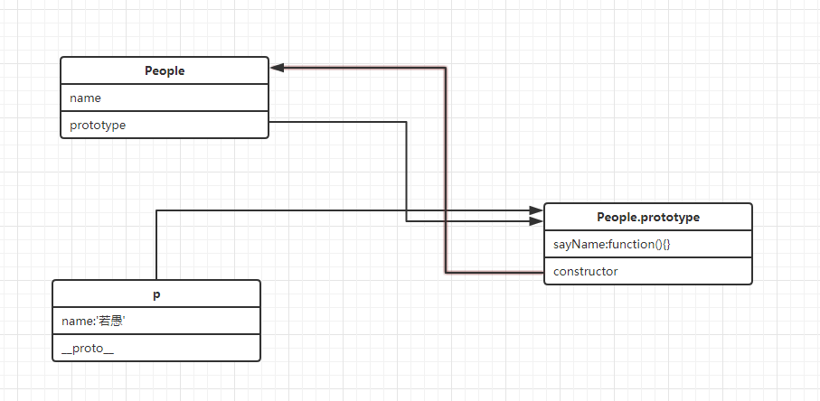
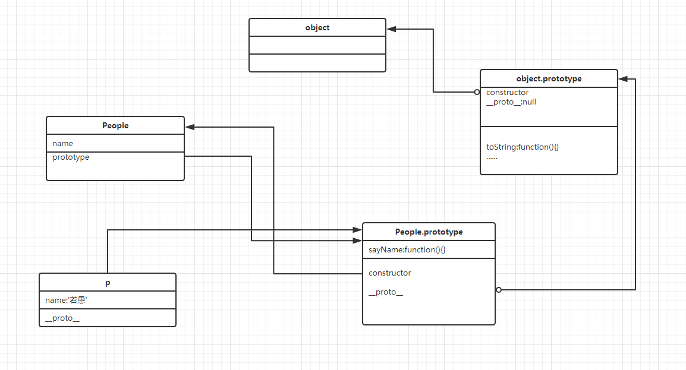
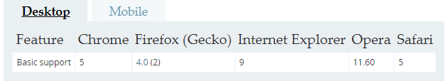

# 问题1： apply、call 、bind有什么作用，什么区别
apply,call,bind可以将调用函数中的this赋值为传入的第一个参数。

apply(obj,[])      //第二个参数为数组,会将数组中的元素作为调用函数的参数

call(obj,arguments)    //直接将call第二个参数及之后的参数作为调用函数的参数传入

bind(obj)        //只有一个参数
# 问题2： 以下代码输出什么?
```
var john = { 
  firstName: "John" 
}
function func() { 
  alert(this.firstName + ": hi!")
}
john.sayHi = func
john.sayHi()    //弹出框为 John: hi!   
                // this为调用函数
```
# 问题3： 下面代码输出什么，为什么
```
func() 
function func() { 
  alert(this)           //window, func() === window.func()
}               
```
#　问题4：下面代码输出什么
```
document.addEventListener('click', function(e){
    console.log(this);         //document
    setTimeout(function(){     
        console.log(this);      //window,  setTimeout(,) ===window.setTimeout(,)
    }, 200);
}, false);
```
# 问题5：下面代码输出什么，why
```
var john = { 
  firstName: "John" 
}

function func() { 
  alert( this.firstName )
}
func.call(john)          //John, call函数将传入的第一个参数赋值给调用函数的this
```
# 问题6： 以下代码有什么问题，如何修改
```
var module= {
  bind: function(){
    $btn.on('click', function(){
      console.log(this) //this指什么       $btn
      this.showMsg();    //报错
    })
  },
  
  showMsg: function(){
    console.log('饥人谷');
  }
}


//修改后
var module= {
  bind: function(){
    _this = this
    $btn.on('click', function(){
      console.log(this) //this指什么
      _this.showMsg();
    })
  },
  
  showMsg: function(){
    console.log('饥人谷');
  }
}
```
# 问题7：有如下代码，解释Person、 prototype、__proto__、p、constructor之间的关联。
```
function Person(name){
    this.name = name;
}
Person.prototype.sayName = function(){
    console.log('My name is :' + this.name);
}
var p = new Person("若愚")
p.sayName();
```

# 问题8： 上例中，对对象 p可以这样调用 p.toString()。toString是哪里来的? 画出原型图?并解释什么是原型链。

当我们读取p.toString()时，JS引擎会做下面的事情：

1. 看看p对象本身有没有toString属性,如果没有，继续下一步
2. 在p.__proto__对象中看有没有toString属性,如果没有,继续下一步
3. 在p.__proto__.__proto__对象中看有没有toString属性
....直到找到toString或者__proto__ 为Null

# 问题9：对String做扩展，实现如下方式获取字符串中频率最高的字符
```
String.prototype.getMostOften = function(){
  var count = {}
  var max = 0
  var maxChar 
  for(var i=0;i<this.length;i++){
    if(count[this[i]]){
      count[this[i]]++
      if(count[this[i]]>max){
        max = count[this[i]]
        maxChar = this[i]
      }
    }else {
      count[this[i]] = 1
    }
  }
  return maxChar
}
var str = 'ahbbccdeddddfg';
var ch = str.getMostOften();
console.log(ch); //d , 因为d 出现了5次
```
# 问题10： instanceOf有什么作用？内部逻辑是如何实现的？
用来测试一个对象在其原型链中是否存在一个构造函数的prototype属性

object instanceof constructor按照对象的原型链,依次判断是否为构造函数的原型

# 问题11：继承有什么作用?
简化代码,子类可以复用父类的内容，而无需重新写一遍已经定义的函数。
# 问题12： 下面两种写法有什么区别?
```
//方法1
function People(name, sex){
    this.name = name;
    this.sex = sex;
    this.printName = function(){
        console.log(this.name);
    }
}
var p1 = new People('饥人谷', 2)

//方法2
function Person(name, sex){
    this.name = name;
    this.sex = sex;
}

Person.prototype.printName = function(){
    console.log(this.name);
}
var p1 = new Person('若愚', 27);

方法1中的printName为自身的属性，每次创建实例都会传入该属性，而方法2为People原型的属性，创建新实例时不会传入该属性。
```
# 问题13： Object.create 有什么作用？兼容性如何？
Object.create使用指定的原型对象及其属性去创建一个新的对象。



# 问题14： hasOwnProperty有什么作用？ 如何使用？
判断该属性是否为该对象的自定义属性,是唯一一个处理属性但是不查找原型链的函数

obj.hasOwnProperty(argument)  
# 问题15：如下代码中call的作用是什么?
```
function Person(name, sex){
    this.name = name;
    this.sex = sex;
}
function Male(name, sex, age){
    Person.call(this, name, sex);    //这里的 call 有什么作用   将Male作为参数赋值给People中的this
    this.age = age;
}
```
# 问题16： 补全代码，实现继承 
```
function Person(name, sex){
    this.name = name
    this.sex = sex
}

Person.prototype.getName = function(){
    console.log(this.name)
};    

function Male(name, sex, age){
   People.call(this,name,sex)
   this.age = age
}

Male.prototype = Object.create(People.prototype)
Male.prototype.constructor = Male
Male.prototype.getAge = function(){
    console.log(this.age)
};

var ruoyu = new Male('若愚', '男', 27);
ruoyu.printName();
```
